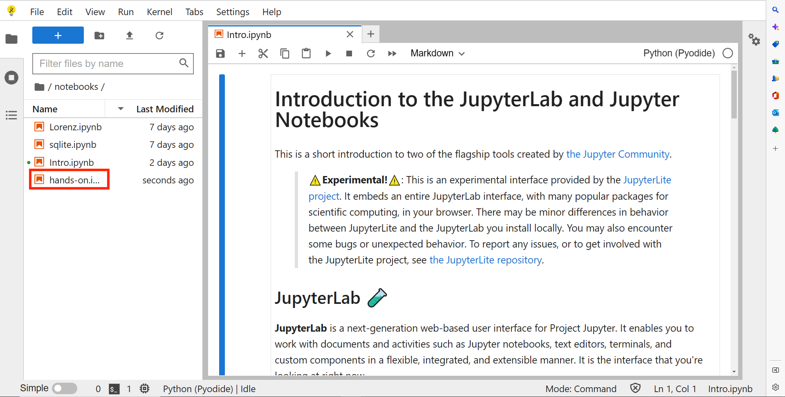

# 科技高「Python体験授業」
2022/12/14(水)
---
## 授業準備手順

0. 以下のURLにアクセス

&emsp;　　[https://github.com/kim-kic/kagi-hs](https://github.com/kim-kic/kagi-hs)

1. 以下のリンクをクリック

&emsp;　リンクの上で**右クリック**して「名前をつけてァイルを保存」を選択 → <a href="https://raw.githubusercontent.com/kim-kic/kagi-hs/main/hands-on.ipynb" download="hands-on.ipynb">hands-on.ipynb</a>

2. 新しく開いたタブで「ダウンロード」ボタンをクリック

3. 以下のリンクをクリック

&emsp;　**コントロール（CTRL）キー**を押しながらクリック → [JupyterLite](https://jupyter.org/try-jupyter/lab/?target=_blank)

4. 新しく開いたタブで画面左上の赤い上矢印（↑）をクリック

5. 手順「2」でダウンロードしたファイル（hans-on.ipynb）をアップロード

6. 手順「5」でアップロードしたファイル（hans-on.ipynb）をクリック

7. 以上で準備ができました。

