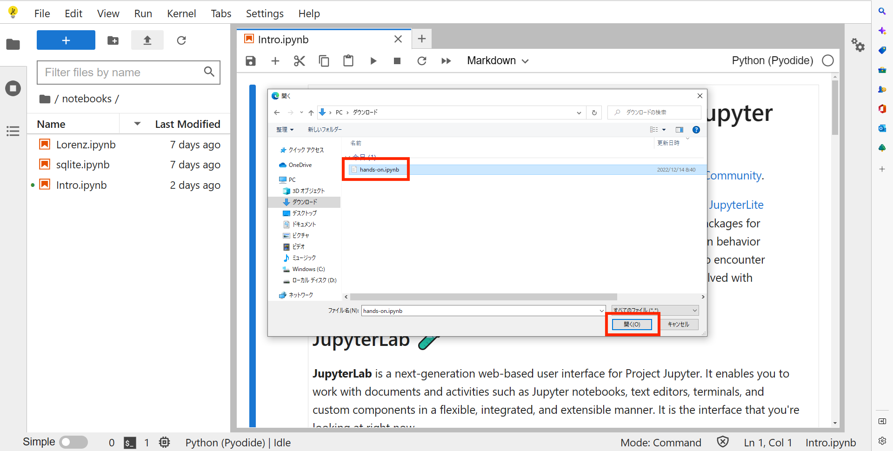
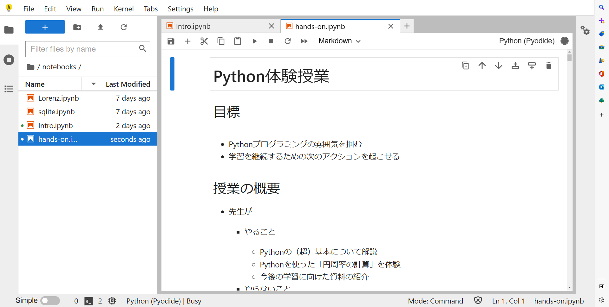

# 科技高「Python体験授業」
2022/12/14(水)
---
## 授業準備手順

1. 以下のファイルをダウンロード

&emsp;　リンクの上で**右クリック**して「名前をつけてファイルを保存」を選択 → <a href="https://raw.githubusercontent.com/kim-kic/kagi-hs/main/hands-on.ipynb" download="hands-on.ipynb">hands-on.ipynb</a>

2. 以下のリンクをクリック

&emsp;　**コントロール（CTRL）キー**を押しながらクリック → [JupyterLite](https://jupyter.org/try-jupyter/lab/)

3. 新しく開いたタブで画面左上の赤い上矢印（↑）をクリック

4. 手順「1」でダウンロードしたファイル（hands-on.ipynb）をアップロード

5. 手順「4」でアップロードしたファイル（hands-on.ipynb）をクリック

6. 以上で準備ができました。

